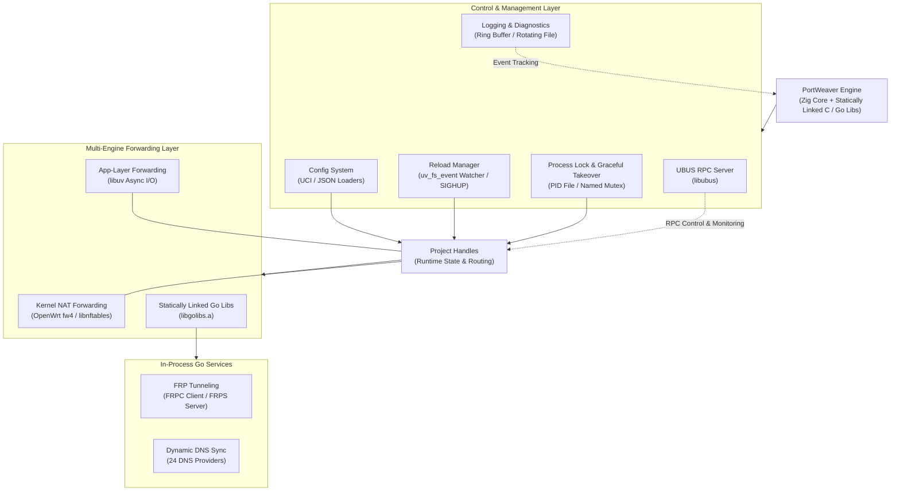

# PortWeaver

[English](README.md) | [中文](README_zh.md)

High-performance port forwarding engine for OpenWrt, written in Zig. Combines kernel-level NAT forwarding with optional userspace forwarding (libuv-based), FRP tunneling, and dynamic DNS -- all statically linked into a single binary.

## Features

- **TCP/UDP Port Forwarding** — Kernel-level NAT via iptables/nftables
- **App-Layer Forwarding** — Userspace TCP/UDP forwarding via libuv with separate per-connection threads
- **Port Range Mapping** — Map port ranges (e.g. `8080-8090` to `9080-9090`) with automatic expansion
- **FRP Client (frpc)** — Statically linked Go library, reverse proxy tunneling (`-Dfrpc=true`)
- **FRP Server (frps)** — Statically linked Go library, act as an FRP server (`-Dfrps=true`)
- **DDNS** — 24 DNS providers (`-Dddns=true`)
- **UCI Config** — Native OpenWrt UCI configuration from `/etc/config/portweaver` (`-Duci=true`)
- **UCI Firewall** — Auto-manage ACCEPT and DNAT/redirect rules via UCI
- **Traffic Statistics** — Per-project byte counters via `enable_app_stats` (app-layer) and `enable_firewall_stats` (nftables kernel counters)
- **Source IP Preservation** — `preserve_source_ip` option for transparent proxying
- **IPv4/IPv6/Both** — Support IPv6 listen forwarding to IPv4 target (app-layer forwarding)

## Quick Start

### Minimal JSON Configuration

Create a `config.json` file:

```json
{
  "$schema": "https://github.com/LazuliKao/portweaver/raw/refs/heads/main/docs/portweaver-config.schema.json",
  "projects": [
    {
      "remark": "Forward HTTP",
      "listen_port": 8080,
      "target_address": "127.0.0.1",
      "target_port": 80,
      "protocol": "tcp",
      "family": "any",
      "enable_app_forward": true,
      "open_firewall_port": false,
      "add_firewall_forward": false
    }
  ]
}
```

Run with:

```bash
portweaver -c config.json
```

### UCI Configuration (OpenWrt)

Create `/etc/config/portweaver`:

```uci
config project 'rdp'
    option remark 'Windows RDP'
    option family 'ipv4'
    option protocol 'tcp'
    option listen_port '3389'
    option target_address '192.168.1.100'
    option target_port '3389'
    option open_firewall_port '1'
    option add_firewall_forward '1'
```

Build with UCI support:

```bash
zig build -Duci=true
```

For a complete configuration example, see [docs/example_config.json](docs/example_config.json).

## Building

### Standard Build

```bash
zig build                              # Default build
zig build -Doptimize=Debug            # Debug build
zig build -Doptimize=ReleaseSmall     # Optimized for embedded (LTO, stripped)
```

### Feature Flags

| Flag | Description |
|------|-------------|
| `-Duci=true` | Enable UCI config support (reads `/etc/config/portweaver`) |
| `-Dubus=true` | Enable UBUS RPC server |
| `-Dfrpc=true` | Enable FRP client (statically linked Go library) |
| `-Dfrps=true` | Enable FRP server (statically linked Go library) |
| `-Dddns=true` | Enable DDNS support (24 providers, statically linked Go library) |

All Go-based features (FRPC, FRPS, DDNS) are compiled together into a single `libgolibs.a` and statically linked into the final binary.

```bash
# Example: all features enabled
zig build -Duci=true -Dubus=true -Dfrpc=true -Dfrps=true -Dddns=true

# Example: embedded deployment with FRP client
zig build -Doptimize=ReleaseSmall -Duci=true -Dubus=true -Dfrpc=true
```

### Testing and Formatting

```bash
zig build test                        # Run all tests
zig fmt src/                          # Format all source files
```

### Remote Development

```bash
zig build dev-remote                  # Watch, build, and auto-upload to remote OpenWrt device
```

## CLI Usage

```
portweaver [options]

Options:
  -c <path>    Path to JSON configuration file (default: config.json)
               Only used in non-UCI builds.
```

In UCI builds (`-Duci=true`), the configuration is always loaded from `/etc/config/portweaver` and the `-c` flag is ignored.

## Architecture

PortWeaver is built as a single, lightweight binary that integrates high-performance userspace packet forwarding, kernel-level firewall NAT rule orchestration, dynamic DNS synchronization, and FRP tunneling—eliminating external process dependencies.



### Subsystems Breakdown

- **Control & Lifecycle Engine** (`main.zig`, `process_lock.zig`):
  - **Single-Instance Enforcement & Graceful Handoff**: Uses file PID lock (Unix) or Named Mutex (Windows) to prevent double instantiation and supports graceful process takeover with a 5-second handoff window.
  - **Event-Driven Execution**: Employs event notification synchronization (`process_lock.waitForEvent()`) instead of wasteful busy-polling loops.
- **Dynamic Config & Hot Reload Subsystem** (`config/`, `reload.zig`):
  - **Dual Loaders**: Supports OpenWrt UCI configuration (`libuci` integration) and structured JSON (`std.json`).
  - **Live Reloading**: Automatically watches JSON configuration files via `libuv` `uv_fs_event` or responds to SIGHUP signals / UBUS RPC triggers, applying configuration changes on-the-fly without tearing down unaffected long-running forwarding streams.
- **Multi-Engine Port Forwarding Subsystem** (`impl/`):
  - **Kernel Firewall NAT (`uci_firewall.zig`, `nft_firewall.zig`)**: Automatically provisions OpenWrt `fw4` / UCI firewall rules or direct `libnftables` rules for DNAT, port redirects, source IP preservation (`preserve_source_ip`), and kernel packet statistics counters (`enable_firewall_stats`).
  - **Userspace App-Layer Forwarding (`impl/app_forward/`)**: Asynchronous, multi-threaded forwarding powered by `libuv` event loops (`loop_manager.zig`). Supports TCP/UDP traffic, cross-family IPv4/IPv6 address translation, socket reuse (`SO_REUSEADDR`), and real-time app-layer byte statistics (`enable_app_stats`).
- **Statically Linked Go Subsystems** (`src/impl/golibs/` -> `libgolibs.a`):
  - **FRP Reverse Proxying (`frpc_forward.zig`, `frps_forward.zig`)**: Statically linked FRP Client and Server modules. Managed entirely in-process via CGO bindings without external `frpc`/`frps` binaries.
  - **Dynamic DNS Sync (`ddns_manager.zig`)**: In-process DDNS update engine supporting 24 DNS providers with configurable polling intervals.
- **UBUS RPC & Diagnostics Subsystem** (`ubus/`, `event_log.zig`, `file_log.zig`):
  - **UBUS Server**: Exposes RPC methods under the `portweaver` namespace for runtime status inspection, per-project dynamic toggle (`set_enabled`), FRPC/FRPS stats, and DDNS logs.
  - **Diagnostics**: Includes a thread-safe circular event log ring buffer (20 entries) and a rotating file logger.

### Startup Sequence

1. **`process_lock.ensureSingleInstance()`** -- Acquire PID file lock / named mutex; execute graceful takeover if another instance is running.
2. **`event_log.initGlobal()`** -- Initialize global thread-safe in-memory event ring buffer.
3. **Signal Handler Registration** -- Register `SIGHUP` signal handler on POSIX systems for live configuration reloads.
4. **`loadConfigFrom()`** -- Load configuration from OpenWrt UCI (`/etc/config/portweaver`) or JSON (`-c` flag).
5. **`file_log.initGlobalFileLogger()`** -- Initialize optional rotating file logger if enabled in config.
6. **`reload.init()`** -- Initialize reload manager and start `libuv` `uv_fs_event` config file watcher (if JSON file watch is enabled).
7. **`applyConfig()`**:
   - Initialize `ProjectHandle` instances for configured projects.
   - Apply kernel firewall / NAT rules (UCI `fw4` or native `libnftables`).
   - Initialize and start enabled DDNS instances.
   - Start active FRPS server instances.
   - Spawn per-project `libuv` app-layer forwarding threads and start FRPC clients.
8. **`ubus_server.start()`** -- Start OpenWrt UBUS RPC server if compiled with `-Dubus=true`.
9. **Event Loop** -- Wait on `process_lock.waitForEvent()` for process shutdown, takeover, or hot reload requests (`reload.apply()`).

## Configuration

### Project Fields

| Field | Type | Default | Description |
|-------|------|---------|-------------|
| `remark` | string | `""` | Project name/description |
| `enabled` | bool | `true` | Enable or disable this project |
| `family` | string | `"any"` | Address family: `any`, `ipv4`, `ipv6` |
| `protocol` | string | `"tcp"` | Protocol: `tcp`, `udp`, `both` |
| `listen_port` | number | -- | Listen port (single-port mode, mutually exclusive with `port_mappings`) |
| `target_address` | string | -- | Target IP or hostname |
| `target_port` | number | -- | Target port (single-port mode) |
| `port_mappings` | array | `[]` | Port range mappings (multi-port mode, mutually exclusive with `listen_port`/`target_port`) |
| `enable_app_forward` | bool | `false` | Enable userspace forwarding via libuv |
| `open_firewall_port` | bool | `true` | Open firewall for listen port |
| `add_firewall_forward` | bool | `true` | Add DNAT/redirect firewall rule |
| `preserve_source_ip` | bool | `false` | Use redirect rules to preserve source IP |
| `enable_app_stats` | bool | `false` | Enable app-layer traffic byte counters (only when `enable_app_forward=true`) |
| `enable_firewall_stats` | bool | `false` | Enable firewall traffic counters via nftables kernel counters (only with nftables backend) |
| `src_zone` | string/array | `"wan"` | Firewall source zone(s) for DNAT/redirect |
| `dest_zone` | string/array | `"lan"` | Firewall destination zone(s) for DNAT/redirect |
| `reuseaddr` | bool | `true` | Enable SO_REUSEADDR on listen socket |

### Port Mappings

Each project can use either single-port mode (`listen_port`/`target_port`) or multi-port mode (`port_mappings`). They are mutually exclusive.

```json
{
  "remark": "Port range forwarding",
  "target_address": "192.168.1.100",
  "enable_app_forward": true,
  "port_mappings": [
    {
      "listen_port": "8080-8090",
      "target_port": "80-90",
      "protocol": "tcp"
    }
  ]
}
```

See [docs/PORT_MAPPINGS.md](docs/PORT_MAPPINGS.md) for detailed port mapping documentation.

See [docs/APP_FORWARD.md](docs/APP_FORWARD.md) for app-layer forwarding documentation.

### Full Configuration Schema

The JSON configuration schema is documented at [docs/portweaver-config.schema.json](docs/portweaver-config.schema.json).

### DDNS Providers

24 DNS providers are supported: `alidns`, `aliesa`, `tencentcloud`, `trafficroute`, `dnspod`, `dnsla`, `cloudflare`, `huaweicloud`, `callback`, `baiducloud`, `porkbun`, `godaddy`, `namecheap`, `namesilo`, `vercel`, `dynadot`, `dynv6`, `spaceship`, `nowcn`, `eranet`, `gcore`, `edgeone`, `nsone`, `name_com`.

## UBUS RPC API

Available when compiled with `-Dubus=true`. The RPC object is named `portweaver`.

### Common Methods

| Method | Parameters | Description |
|--------|-----------|-------------|
| `get_status` | -- | Overall engine status (projects, ports, traffic, uptime) |
| `get_full_status` | -- | Detailed status with all subsystem info |
| `list_projects` | -- | List all configured projects |
| `set_enabled` | `(id: int, enabled: bool)` | Enable or disable a project by ID |
| `get_events` | -- | Get recent event log entries |

### FRP Methods

Available when compiled with `-Dfrpc=true` or `-Dfrps=true`.

| Method | Parameters | Description |
|--------|-----------|-------------|
| `get_frp_status` | -- | Combined FRP client + server status |

#### FRP Client Methods (`-Dfrpc=true`)

| Method | Parameters | Description |
|--------|-----------|-------------|
| `get_frpc_info` | `(id: string)` | FRP client project info |
| `get_frpc_proxy_stats` | `(id: string)` | FRP client proxy statistics |
| `clear_frpc_logs` | `(id: string)` | Clear FRP client logs |

#### FRP Server Methods (`-Dfrps=true`)

| Method | Parameters | Description |
|--------|-----------|-------------|
| `get_frps_info` | `(id: string)` | FRP server project info |
| `get_frps_proxy_stats` | `(id: string)` | FRP server proxy statistics |
| `clear_frps_logs` | `(id: string)` | Clear FRP server logs |

### DDNS Methods (`-Dddns=true`)

| Method | Parameters | Description |
|--------|-----------|-------------|
| `get_ddns_global_status` | -- | All DDNS instances status |
| `get_ddns_status` | -- | DDNS status summary |
| `get_ddns_info` | `(name: string)` | Specific DDNS config info |
| `clear_ddns_logs` | `(name: string)` | Clear specific DDNS logs |

## Project Structure

```
src/
  main.zig                     # Entry point, main loop, startup sequence
  event_log.zig                # Thread-safe in-memory event ring buffer
  file_log.zig                 # Rotating file logger
  process_lock.zig             # Single-instance PID/mutex lock with graceful takeover
  compat.zig                   # Cross-platform compatibility layer
  config/
    types.zig                  # Configuration data structures
    mod.zig                    # Config module exports
    provider.zig               # Config provider abstraction
    uci_loader.zig             # UCI config loading
    json_loader.zig            # JSON config loading
  impl/
    app_forward.zig            # Application-layer forwarding orchestration
    app_forward/
      common.zig               # Shared forwarding utilities
      loop_manager.zig         # Runtime event-loop manager (shared/per-project)
      forwarder_runtime.zig    # C runtime boundary adapter
      tcp_forwarder_uv.zig     # TCP forwarder (libuv-based)
      udp_forwarder_uv.zig     # UDP forwarder (libuv-based)
      forwarder/               # C forwarder implementation (backend-neutral ABI)
    nft_firewall.zig           # nftables firewall rule management
    uci_firewall.zig           # UCI firewall rule management
    frp_common.zig             # Shared FRP utilities
    frpc_forward.zig           # FRP client forwarding logic
    frps_forward.zig           # FRP server forwarding logic
    frp_status.zig             # FRP status monitoring
    ddns_manager.zig           # DDNS lifecycle management
    project_status.zig         # Project handle and runtime state
    frpc/libfrpc.zig           # FRP client C API bindings
    frps/libfrps.zig           # FRP server C API bindings
    ddns/libddns.zig           # DDNS C API bindings
    golibs/                    # Go library sources (FRPC + FRPS + DDNS)
  nftables/
    mod.zig                    # nftables module exports
    libnftables.zig            # libnftables C bindings
  uci/
    mod.zig                    # UCI module exports
    types.zig                  # UCI data types
    libuci.zig                 # libuci C bindings
  ubus/
    server.zig                 # UBUS RPC server implementation
    libubus.zig                # libubus C bindings
    libblobmsg_json.zig        # blobmsg JSON utilities
    ubox.zig                   # ubox utilities
  loader/
    dynamic_lib.zig            # Dynamic library loading
deps/                          # External C libraries (libuv, uci, ubus)
```

## License

GPL-3.0. See [LICENSE](LICENSE) for details.
