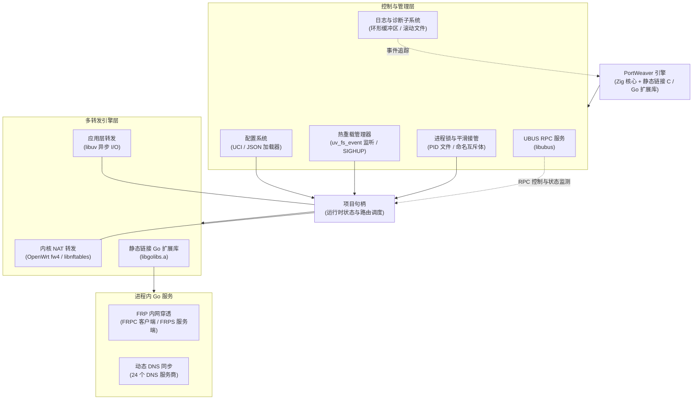

# PortWeaver

[English](README.md) | [中文](README_zh.md)

高性能端口转发统一管理引擎，基于 Zig 构建，适用于 OpenWrt。

---

## 概述

PortWeaver 是一个为 OpenWrt 设计的高性能端口转发统一管理引擎，使用 Zig 编写。它将内核级 NAT 转发与可选的用户态转发（基于 libuv）、FRP 隧道和动态 DNS 结合在一起，全部静态链接到单个二进制文件中。

## 功能特性

- **TCP/UDP 端口转发** — 通过 iptables/nftables 的内核级 NAT 转发
- **应用层转发** — 基于 libuv 的用户态转发，支持 TCP + UDP，独立线程
- **端口范围映射** — 例如 8080-8090 映射到 9080-9090，自动扩展
- **FRP 客户端 (frpc)** — 可选，静态链接 Go 库，`-Dfrpc=true`
- **FRP 服务端 (frps)** — 可选，静态链接 Go 库，`-Dfrps=true`
- **DDNS** — 可选，支持 24 个 DNS 提供商，`-Dddns=true`
- **UCI 配置** — 可选，`-Duci=true`，从 `/etc/config/portweaver` 读取
- **UCI 防火墙** — 自动管理 ACCEPT + DNAT/重定向规则
- **流量统计** — 每项目字节计数器，支持 `enable_app_stats`（应用层）和 `enable_firewall_stats`（nftables 内核计数器）
- **源 IP 保留** — `preserve_source_ip` 选项用于透明代理
- **IPv4/IPv6/双栈** — 支持 IPv6 监听转发到 IPv4 目标（应用层转发）

### DDNS 支持的提供商

alidns, aliesa, tencentcloud, trafficroute, dnspod, dnsla, cloudflare, huaweicloud, callback, baiducloud, porkbun, godaddy, namecheap, namesilo, vercel, dynadot, dynv6, spaceship, nowcn, eranet, gcore, edgeone, nsone, name_com

## 快速开始

### 最小 JSON 配置

```json
{
    "$schema": "https://github.com/LazuliKao/portweaver/raw/refs/heads/main/docs/portweaver-config.schema.json",
    "projects": [
        {
            "remark": "HTTP 转发",
            "target_address": "127.0.0.1",
            "listen_port": 8080,
            "target_port": 80,
            "protocol": "tcp",
            "family": "any",
            "enable_app_forward": true,
            "open_firewall_port": false,
            "add_firewall_forward": false
        }
    ]
}
```

完整配置示例请参考 [docs/example_config.json](docs/example_config.json)。

## 编译

### 基础构建

```bash
# 默认构建
zig build

# 调试构建
zig build -Doptimize=Debug

# 针对嵌入式优化（ReleaseSmall）
zig build -Doptimize=ReleaseSmall
```

### 功能标志

```bash
zig build -Duci=true        # 启用 UCI 配置支持
zig build -Dubus=true       # 启用 UBUS RPC 服务器
zig build -Dfrpc=true       # 启用 FRP 客户端
zig build -Dfrps=true       # 启用 FRP 服务端
zig build -Dddns=true       # 启用 DDNS 支持
```

多个功能标志可以组合使用：

```bash
zig build -Dfrpc=true -Dfrps=true -Dddns=true -Dubus=true
```

### 测试与格式化

```bash
# 运行所有测试
zig build test

# 格式化源码
zig fmt src/
```

## 命令行用法

```
portweaver [选项]
  -c <路径>    JSON 配置文件路径（默认：config.json）
               仅在非 UCI 构建中使用。
```

## 架构

PortWeaver 采用单一轻量化二进制文件设计，集成了高性能用户态数据包转发、内核级防火墙 NAT 规则调度、动态 DNS 同步以及 FRP 内网穿透隧道——无需依赖任何外部进程。



### 子系统详解

- **控制与生命周期引擎** (`main.zig`, `process_lock.zig`)：
  - **单实例互斥与平滑接管**：通过 PID 文件锁（Unix）或命名互斥体（Windows）防止重复启动，并支持 5 秒缓冲期的平滑进程接管（Takeover）。
  - **事件驱动主循环**：采用事件通知机制（`process_lock.waitForEvent()`）代替高 CPU 消耗的轮询模式。
- **动态配置与热重载子系统** (`config/`, `reload.zig`)：
  - **双配置加载器**：原生支持 OpenWrt UCI 配置（`libuci` 绑定）与结构化 JSON（`std.json`）。
  - **热重载机制**：通过 `libuv` `uv_fs_event` 自动监听 JSON 配置文件变动，或响应 `SIGHUP` 信号与 UBUS RPC 指令，实现无需中断现有活跃转发流的无缝平滑重载。
- **多转发引擎子系统** (`impl/`)：
  - **内核防火墙 NAT (`uci_firewall.zig`, `nft_firewall.zig`)**：自动配置 OpenWrt `fw4` / UCI 防火墙规则或直接调用 `libnftables` 管理 DNAT、端口重定向、源 IP 保留（`preserve_source_ip`）及内核级数据包统计计数器（`enable_firewall_stats`）。
  - **用户态应用层转发 (`impl/app_forward/`)**：基于 `libuv` 事件循环（`loop_manager.zig`）的多线程异步 I/O 引擎。支持 TCP/UDP 转发、IPv4/IPv6 跨协议栈转换、套接字复用（`SO_REUSEADDR`）及实时字节流量统计（`enable_app_stats`）。
- **静态链接 Go 扩展库** (`src/impl/golibs/` -> `libgolibs.a`)：
  - **FRP 反向代理 (`frpc_forward.zig`, `frps_forward.zig`)**：静态链接的 FRP Client 和 Server 模块，全在进程内通过 CGO 绑定管理，无需依赖外部 `frpc`/`frps` 可执行文件。
  - **动态 DNS 同步 (`ddns_manager.zig`)**：进程内 DDNS 更新引擎，支持 24 家 DNS 服务商及可配置的检查间隔。
- **UBUS RPC 与诊断子系统** (`ubus/`, `event_log.zig`, `file_log.zig`)：
  - **UBUS RPC 服务**：在 `portweaver` 命名空间下暴露 RPC 方法，支持查询运行状态、按项目动态开关（`set_enabled`）、FRP 统计及 DDNS 日志。
  - **诊断日志**：内置线程安全环形事件日志缓冲区（容量 20）及滚动文件日志记录器。

### 启动流程

1. `process_lock.ensureSingleInstance()` — 获取 PID 文件锁 / 命名互斥体；若已有实例运行则触发平滑接管。
2. `event_log.initGlobal()` — 初始化全局线程安全内存事件环形缓冲区。
3. **注册信号处理器** — 在 POSIX 系统上注册 `SIGHUP` 信号以支持热重载。
4. `loadConfigFrom()` — 从 OpenWrt UCI (`/etc/config/portweaver`) 或 JSON (`-c` 参数) 加载配置。
5. `file_log.initGlobalFileLogger()` — 初始化可选的滚动文件日志记录器。
6. `reload.init()` — 初始化重载模块，若启用 JSON 文件监听则启动 `libuv` `uv_fs_event` 配置文件监听器。
7. `applyConfig()`：
   - 为各个已启用项目初始化 `ProjectHandle` 句柄。
   - 应用内核防火墙 / NAT 规则（UCI `fw4` 或原生 `libnftables`）。
   - 初始化并启动已启用的 DDNS 实例。
   - 启动活跃的 FRPS 服务端实例。
   - 为各个项目生成 `libuv` 用户态转发线程并启动 FRPC 客户端。
8. `ubus_server.start()` — 若以 `-Dubus=true` 编译则启动 OpenWrt UBUS RPC 服务。
9. **主事件循环** — 阻塞等待 `process_lock.waitForEvent()` 响应程序退出、进程接管或热重载请求（`reload.apply()`）。

## UBUS RPC API

使用 `-Dubus=true` 编译时启用。

| 方法 | 参数 | 描述 |
|------|------|------|
| `get_status` | - | 获取整体引擎状态 |
| `get_full_status` | - | 获取包含所有子系统信息的详细状态 |
| `list_projects` | - | 列出所有已配置的项目 |
| `set_enabled` | `(id, enabled)` | 按 ID 启用/禁用项目 |
| `get_events` | - | 获取最近的事件日志条目 |
| `get_frp_status` | - | 获取 FRP 客户端+服务端的组合状态 |
| `get_frpc_info` | `(id)` | 获取 FRP 客户端项目信息 |
| `get_frpc_proxy_stats` | `(id)` | 获取 FRP 客户端代理统计 |
| `clear_frpc_logs` | `(id)` | 清除 FRP 客户端日志 |
| `get_frps_info` | `(id)` | 获取 FRP 服务端项目信息 |
| `get_frps_proxy_stats` | `(id)` | 获取 FRP 服务端代理统计 |
| `clear_frps_logs` | `(id)` | 清除 FRP 服务端日志 |
| `get_ddns_global_status` | - | 获取所有 DDNS 实例状态 |
| `get_ddns_status` | - | 获取 DDNS 状态摘要 |
| `get_ddns_info` | `(name)` | 获取特定 DDNS 配置信息 |
| `clear_ddns_logs` | `(name)` | 清除特定 DDNS 日志 |

## 配置

### 配置字段

每条"项目"包含以下字段：

| 字段 | 描述 |
|------|------|
| `remark` | 备注名称 |
| `family` | 地址族：`any` / `ipv4` / `ipv6` |
| `protocol` | 协议：`tcp` / `udp` / `both` |
| `listen_port` | 监听端口（支持范围，如 `8080-8090`） |
| `target_address` | 目标地址 |
| `target_port` | 目标端口（支持范围） |
| `enable_app_forward` | 启用应用层转发（基于 libuv） |
| `open_firewall_port` | 打开防火墙端口 |
| `add_firewall_forward` | 添加防火墙转发规则 |
| `src_zone` | 源区域（默认：wan） |
| `dest_zone` | 目标区域（默认：lan） |
| `preserve_source_ip` | 源 IP 保留（用于透明代理） |
| `enable_app_stats` | 启用应用层流量统计（仅当 `enable_app_forward=true` 时有效） |
| `enable_firewall_stats` | 启用防火墙流量统计（nftables 内核计数器，仅 nftables 后端） |
| `port_mappings` | 端口范围映射数组（详见下方） |

### 端口范围映射

支持将一段端口范围映射到另一段端口范围。详细文档请参考 [docs/PORT_MAPPINGS.md](docs/PORT_MAPPINGS.md)。

```json
{
    "listen_port": "8080-8090",
    "target_port": "9080-9090",
    "protocol": "tcp"
}
```

### 应用层转发

基于 libuv 的用户态 TCP/UDP 转发，无需依赖系统防火墙。详细文档请参考 [docs/APP_FORWARD.md](docs/APP_FORWARD.md)。

在配置中设置 `"enable_app_forward": true` 即可启用。

### UCI 配置

使用 `-Duci=true` 编译时，从 `/etc/config/portweaver` 读取配置：

```uci
config project 'rdp'
    option remark 'Windows RDP'
    option family 'IPv4'
    option protocol 'TCP'
    option listen_port '3389'
    option target_address '192.168.1.100'
    option target_port '3389'
    option open_firewall_port '1'
    option add_firewall_forward '1'
```

### FRP 客户端配置

```json
{
  "frpc_nodes": {
    "node1": {
      "enabled": true,
      "server": "1.2.3.4",
      "port": 7000,
      "token": "your_token",
      "log_level": "info",
      "use_encryption": true,
      "use_compression": true
    }
  }
}
```

### FRP 服务端配置

使用 `-Dfrps=true` 编译时启用：

```json
{
  "frps_nodes": {
    "server1": {
      "enabled": true,
      "port": 7000,
      "token": "your_token",
      "log_level": "info",
      "allow_ports": "10000-20000",
      "bind_addr": "0.0.0.0",
      "tcp_mux": true,
      "udp_mux": true,
      "kcp_mux": true,
      "dashboard_addr": "0.0.0.0",
      "dashboard_user": "admin",
      "dashboard_pwd": "admin"
    }
  }
}
```

### DDNS 配置

使用 `-Dddns=true` 编译时启用：

```json
{
  "ddns": [
    {
      "name": "cloudflare-home",
      "dns_provider": "cloudflare",
      "dns_id": "",
      "dns_secret": "your_cloudflare_token",
      "ttl": 3600,
      "ipv4_enable": true,
      "ipv4_get_type": "url",
      "ipv4_url": "https://api.ipify.org",
      "ipv4_domains": "home.example.com",
      "ipv6_enable": false,
      "not_allow_wan_access": true
    }
  ]
}
```

## 文档

- [docs/APP_FORWARD.md](docs/APP_FORWARD.md) — 应用层转发完整文档
- [docs/PORT_MAPPINGS.md](docs/PORT_MAPPINGS.md) — 端口范围映射文档
- [docs/portweaver-config.schema.json](docs/portweaver-config.schema.json) — JSON 配置 schema

## 许可证

[GPL-3.0](LICENSE)
